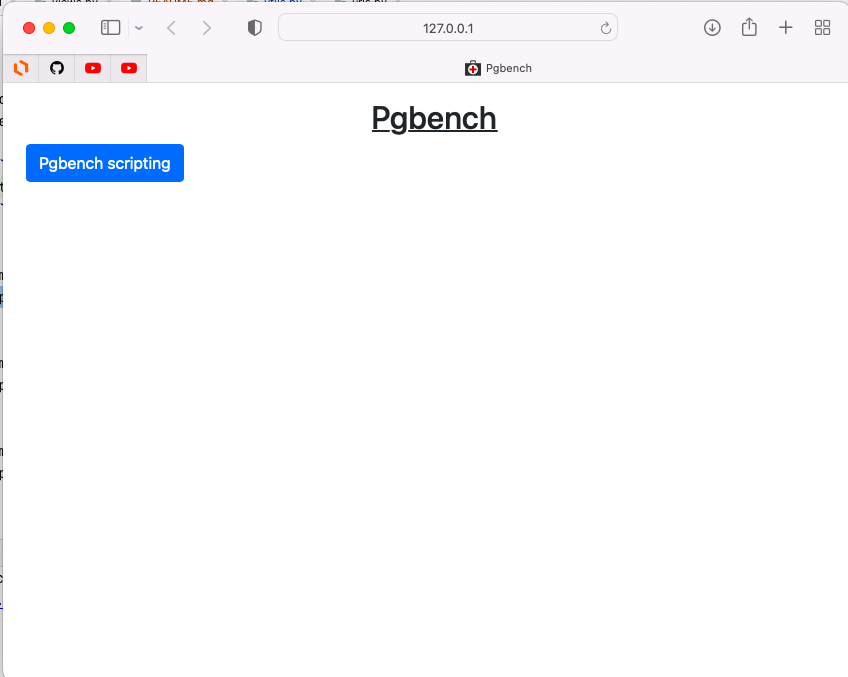
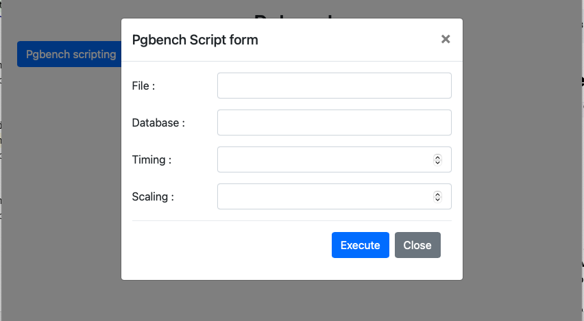
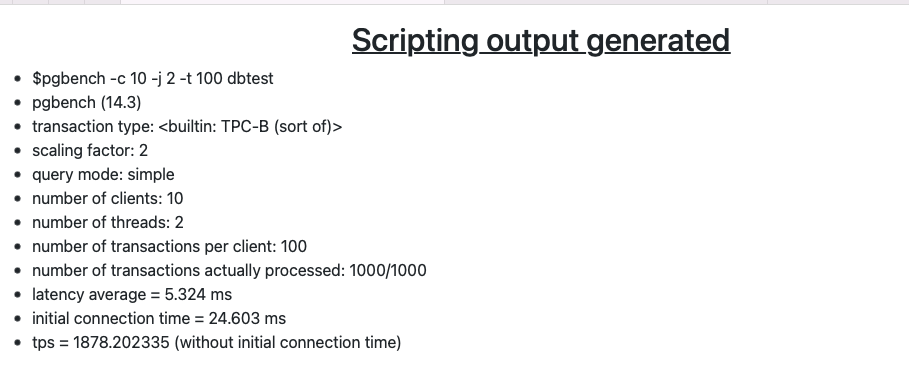

# Pgbench Web app

The pgbench web app provides a web application that allows user to execute scripts without the use of a command line.

This application is implemented using Python 3 with the Django framework along with the Bootstrap framework.

*Note: This build is optimized for development purposes only.*

## Requirements

This application requires Python3, pip and the Postgres.

## Installation
Run all commands from the root directory. It is highly recommended to set up the application in a Python 3 Virtual Environment. The use of the pycharm IDE is highly recommended for this step.

### Installing Python Dependencies
```commandline
pip3 install -r requirements.txt
```


## Running

Once installation is complete and Postgres running in the background, run the following command at the root of your project .
The server will run on port 8000 by default on localhost.

```commandline
python3 manage.py runserver
```
## Screenshots
<p align="center">

</p>

<p align="center">
Clicking on the button "Pgbench scripting" will generate a modal with a form for the user to enter some data

</p>

<p align="center">
    Upon form input validation and submitting the data, the output generate from the script should be displayed on another page.
    
</p>


 
